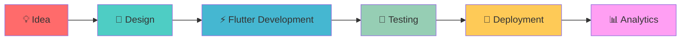
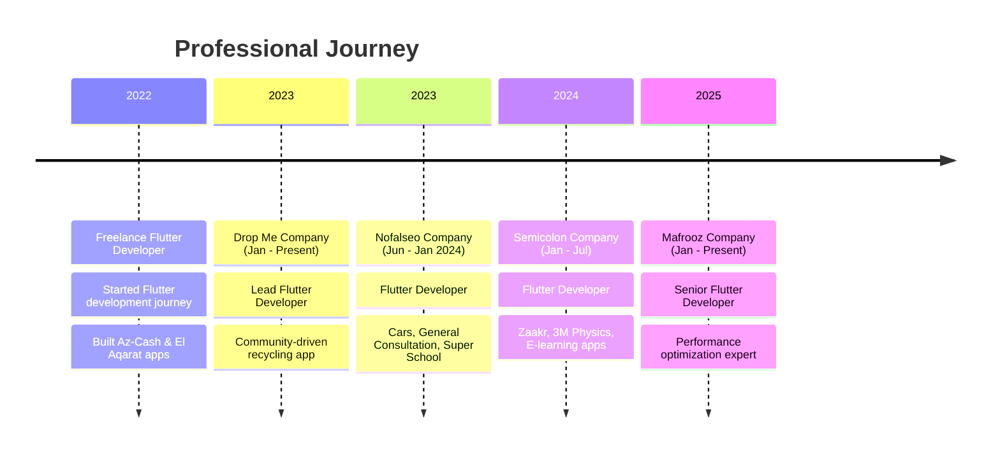
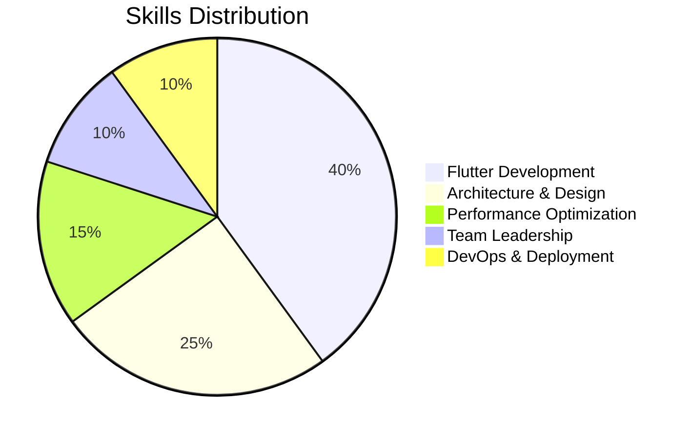
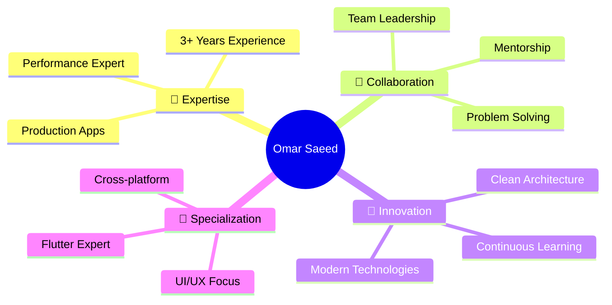

# 👋 Omar Saeed - Flutter Developer

<div align="center">
  
[](https://git.io/typing-svg)

[](https://www.linkedin.com/in/omar-saeed-5a25491ba)
[](mailto:omarhamode106@gmail.com)
[](https://wa.me/qr/S75YYDZVP773A1)
[](https://www.facebook.com/profile.php?id=100074359659144)


</div>

---

## 🚀 About Me

> 💻 **Passionate Flutter Developer** from Egypt with **3+ years** of experience in building production-level mobile applications

- 🎯 **Expertise**: Cross-platform mobile apps (Android, iOS, Web, Desktop)
- 📱 **Specialization**: High-performance apps with clean architecture
- 🏆 **Achievement**: Reduced app load times by **70%** across projects
- 🎓 **Education**: B.Sc. Commerce (English Section) - Menoufia University (2019-2023)
- 👨‍🏫 **Mentorship**: Guided **6+ junior developers** on Flutter best practices



---

## 🎯 Technical Skills

### 📱 **Mobile Development**
```
Flutter & Dart        ████████████████████ 95%
State Management      ████████████████████ 90%
Clean Architecture    ████████████████████ 88%
Performance Tuning    ████████████████████ 85%
```

<details>
<summary><strong>🔧 Core Technologies</strong></summary>

| Technology | Proficiency | Experience |
|------------|-------------|------------|
| **Flutter** | ⭐⭐⭐⭐⭐ | 3+ years |
| **Dart** | ⭐⭐⭐⭐⭐ | 3+ years |
| **BLoC/Cubit** | ⭐⭐⭐⭐⭐ | 2+ years |
| **GetX** | ⭐⭐⭐⭐ | 2+ years |
| **Provider** | ⭐⭐⭐⭐ | 2+ years |
| **Firebase** | ⭐⭐⭐⭐⭐ | 3+ years |

</details>

### 🛠️ **Tech Stack**

<div align="center">

#### **Languages & Frameworks**


#### **State Management**


#### **Backend & Services**


#### **Tools & Platforms**


</div>

---

## 👔 Professional Experience



### 🏢 **Current Positions**

<table>
<tr>
<td width="50%">

#### 🚀 **Mafrooz Company**
**Senior Flutter Developer** _(Jan 2025 - Present)_
- Performance optimization specialist
- User experience enhancement
- Advanced architecture implementation

</td>
<td width="50%">

#### ♻️ **Drop Me Company** 
**Lead Flutter Developer** _(Jan 2023 - Present)_
- Community-driven recycling platform
- Real-time rewards system
- Sustainable practices gamification

</td>
</tr>
</table>

---

## 📚 Featured Projects

<div align="center">

### 🏆 **Production Apps**

| App | Platform | Downloads | Rating |
|-----|----------|-----------|---------|
| **Ejazah اجازة** | [](https://play.google.com/store/apps/details?id=com.visooft.ejazah) | 10K+ | ⭐ 4.5 |
| **Zaakr** | [](#) | 5K+ | ⭐ 4.8 |
| **Super School Parents** | [](#) | 1K+ | ⭐ 4.6 |

</div>

<details>
<summary><strong>🔍 Project Details</strong></summary>

### 🏖️ **Ejazah اجازة**
> Licensed tourism platform by Ministry of Tourism
- **Features**: Shared accommodation, tourism events, holiday homes
- **Tech Stack**: Flutter, Firebase, Google Maps, Payment Integration
- **Achievement**: Successfully deployed production app with 10K+ downloads

### 💡 **General Consultation**
> B2B consulting platform connecting businesses with experts
- **GitHub**: [View Repository](https://github.com/OmarSaeed20/General-Consultation-.git)
- **Features**: Real-time consultations, multi-domain expertise
- **Domains**: Marketing, Finance, Strategy consulting

### ♻️ **Drop Me**
> Community-driven bottle recycling initiative
- **GitHub**: [View Repository](https://github.com/OmarSaeed20/Drop-Me.git)
- **Features**: Rewards system, community engagement, sustainability tracking
- **Impact**: Promoting eco-friendly practices through gamification

### 🚗 **Cars**
> C2S marketplace for automotive services
- **GitHub**: [View Repository](https://github.com/OmarSaeed20/Cars.git)
- **Features**: Service provider matching, maintenance booking, spare parts
- **Architecture**: Clean Architecture with BLoC state management

</details>

---

## 🏆 Key Achievements

<div align="center">

| 🎯 Achievement | 📊 Impact | 🗓️ Timeline |
|----------------|-----------|-------------|
| **Performance Optimization** | 70% faster load times | 2023-2024 |
| **Team Leadership** | Mentored 6+ developers | 2023-Present |
| **Localization Expert** | Arabic/English in all apps | 2022-Present |
| **Production Deployments** | 8+ apps on Google Play | 2022-Present |

</div>



---

## 🎓 Education & Certifications

### 🏫 **Academic Background**
**B.Sc. in Commerce (English Section)**  
*Menoufia University, Egypt* | **2019 - 2023**

### 📜 **Professional Certifications**

<table>
<tr>
<td>

#### 🏗️ **Flutter MVVM with Clean Architecture**
- **Instructor**: Mina Farid
- **Duration**: 22 Hours
- **Date**: Dec 2022
- **Focus**: Advanced state management, BLoC, Repository pattern, TDD

</td>
<td>

#### 🔧 **Advanced Flutter Clean Architecture**
- **Instructor**: Usama Elgendy  
- **Duration**: 8 Hours
- **Date**: Oct 2022
- **Focus**: Domain-driven design, Dependency inversion

</td>
</tr>
<tr>
<td colspan="2">

#### 📱 **The Complete 2022 Flutter & Dart Development**
- **Instructor**: Abdullah Mansour | **Duration**: 42 Hours | **Date**: Feb 2022
- **Comprehensive Coverage**: Dart fundamentals, full-stack Flutter, responsive UI for Android/iOS/Web
- **Key Skills**: Clean code practices, testing strategies, scalable architecture, job market readiness

</td>
</tr>
</table>

---

## 📊 GitHub Analytics

<div align="center">


</div>

<div align="center">

[](https://git.io/streak-stats)

</div>

---

## 🌐 Languages

| Language | Proficiency | Usage |
|----------|-------------|-------|
| 🇪🇬 **Arabic** | Native | Professional & Personal |
| 🇺🇸 **English** | Professional | Technical Documentation & Communication |

---

## 💼 Why Choose Omar?

<div align="center">



</div>

### ✨ **Core Strengths**
- 🎯 **Proven Track Record**: 8+ production apps with 20K+ combined downloads
- ⚡ **Performance Expert**: Consistently improved app performance by 70%
- 👥 **Team Leadership**: Successfully mentored junior developers
- 🏗️ **Architecture Guru**: Clean Architecture and SOLID principles advocate
- 🌍 **Global Ready**: Multilingual apps with proper localization

---

## 📞 Let's Connect!

<div align="center">

### 🤝 **Ready to collaborate? Let's build something amazing together!**

[](mailto:omarhamode106@gmail.com)
[](https://www.linkedin.com/in/omar-saeed-5a25491ba)
[](https://wa.me/qr/S75YYDZVP773A1)
[](https://github.com/OmarSaeed20)

</div>

---

<div align="center">

**⭐ Star this repository if you found it helpful!**

*Last updated: July 2025*

</div>
